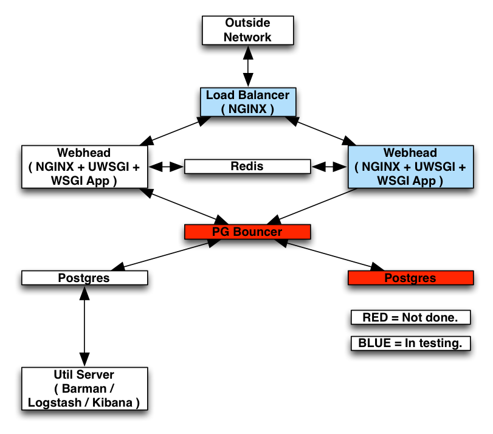
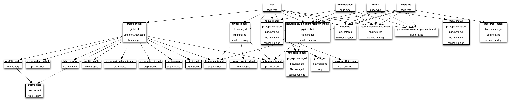

# LNUP (Linux, NGINX, uWSGI, Postgres)

# What is deployed

## Automation Platform

* [SaltStack](http://saltstack.com/) 2014.1.0 RC3.

## Web Server

* [Ubuntu Server](http://www.ubuntu.com/server) [12.04 LTS](http://www.ubuntu.com/content/what%E2%80%99s-new-ubuntu-server-1204-lts).
* [NGINX Extras](http://nginx.com/) from [NGINX Stable PPA](https://launchpad.net/~nginx/+archive/stable).
* [uWSGI](http://uwsgi-docs.readthedocs.org/en/latest/).
* [Beaver](https://github.com/josegonzalez/beaver).
* [New Relic Server Monitoring](http://newrelic.com/server-monitoring).
* [New Relic Plug-in "newrelic-plugin-agent"](http://newrelic.com/plugins/meetme-inc/56).

## Postgres Server

* [Ubuntu Server](http://www.ubuntu.com/server) [12.04 LTS](http://www.ubuntu.com/content/what%E2%80%99s-new-ubuntu-server-1204-lts).
* [PostgreSQL 9.2](http://www.postgresql.org/) from [Apt Repository](http://www.postgresql.org/download/linux/ubuntu/).
* [Beaver](https://github.com/josegonzalez/beaver).
* [New Relic Server Monitoring](http://newrelic.com/server-monitoring).
* [New Relic Plug-in "newrelic-plugin-agent"](http://newrelic.com/plugins/meetme-inc/56).

## Redis Server

* [Ubuntu Server](http://www.ubuntu.com/server) [12.04 LTS](http://www.ubuntu.com/content/what%E2%80%99s-new-ubuntu-server-1204-lts).
* [Redis](http://redis.io/) from [PPA](https://launchpad.net/~chris-lea/+archive/redis-server).
* [New Relic Server Monitoring](http://newrelic.com/server-monitoring).
* [New Relic Plug-in "newrelic-plugin-agent"](http://newrelic.com/plugins/meetme-inc/56).

## Util Server

* [Ubuntu Server](http://www.ubuntu.com/server) [12.04 LTS](http://www.ubuntu.com/content/what%E2%80%99s-new-ubuntu-server-1204-lts).
* [NGINX Extras](http://nginx.com/) from [NGINX Stable PPA](https://launchpad.net/~nginx/+archive/stable).
* [Barman](http://www.pgbarman.org/) from [PPA](https://launchpad.net/ubuntu/+source/barman).
* [Beaver](https://github.com/josegonzalez/beaver).
* [Logstash](http://logstash.net/).
* [Kibana 3](http://www.elasticsearch.org/overview/kibana/).
* [New Relic Server Monitoring](http://newrelic.com/server-monitoring).
* [New Relic Plug-in "newrelic-plugin-agent"](http://newrelic.com/plugins/meetme-inc/56).

### Communication Flow


### Dependency Graph


### Tree Graph
```
lnup/
├── LICENSE
├── README.md
├── git-media
│   ├── LNUP.graffle
│   ├── LNUP.png
│   ├── communication_flow.graffle
│   └── communication_flow.png
├── map
│   ├── development.map
│   ├── production.map
│   └── staging.map
├── pillar
│   ├── dev_settings.sls
│   ├── global_settings.sls
│   ├── prod_settings.sls
│   ├── stag_settings.sls
│   └── top.sls
└── salt
    ├── node-types
    │   ├── lb
    │   │   └── init.sls
    │   ├── postgres
    │   │   └── init.sls
    │   ├── redis
    │   │   └── init.sls
    │   ├── util
    │   │   └── init.sls
    │   └── web
    │       └── init.sls
    ├── packages
    │   ├── barman.sls
    │   ├── beaver
    │   │   ├── beaver_config.sls
    │   │   ├── files
    │   │   │   ├── beaver.conf.jinja
    │   │   │   └── beaver.upstart.jinja
    │   │   └── init.sls
    │   ├── git.sls
    │   ├── kibana.sls
    │   ├── libcap-dev.sls
    │   ├── libldap2-dev.sls
    │   ├── libpq-dev.sls
    │   ├── libsasl2-dev.sls
    │   ├── libssl-dev.sls
    │   ├── logstash
    │   │   ├── files
    │   │   │   └── logstash.upstart.jinja
    │   │   └── init.sls
    │   ├── new_relic.sls
    │   ├── newrelic_plugin_agent
    │   │   ├── files
    │   │   │   ├── newrelic-plugin-agent-monitor.cfg.jinja
    │   │   │   └── newrelic_plugin_agent.startup
    │   │   ├── init.sls
    │   │   └── newrelic-plugin-agent-monitor.sls
    │   ├── nginx
    │   │   ├── files
    │   │   │   ├── maintenance.html
    │   │   │   ├── nginx.conf
    │   │   │   └── nginx.upstart
    │   │   ├── init.sls
    │   │   ├── nginx_config.sls
    │   │   └── nginx_maintenance_page.sls
    │   ├── openjdk-7-jre-headless.sls
    │   ├── postgres.sls
    │   ├── postgresql-client-92.sls
    │   ├── postgresql-client-common.sls
    │   ├── python
    │   │   ├── python-dev
    │   │   │   └── init.sls
    │   │   ├── python-ldap
    │   │   │   └── init.sls
    │   │   ├── python-mysqldb
    │   │   │   └── init.sls
    │   │   ├── python-pip
    │   │   │   ├── init.sls
    │   │   │   └── pip.conf
    │   │   ├── python-psycopg2
    │   │   │   └── init.sls
    │   │   ├── python-software-properties
    │   │   │   └── init.sls
    │   │   └── python-virtualenv
    │   │       └── init.sls
    │   ├── redis.sls
    │   ├── set_time.sls
    │   ├── ssh_keys.sls
    │   ├── updates.sls
    │   ├── uwsgi
    │   │   ├── files
    │   │   │   ├── uwsgi.upstart
    │   │   │   └── uwsgi.yaml.jinja
    │   │   └── init.sls
    │   ├── uwsgitop.sls
    │   └── vim.sls
    ├── project
    │   └── app
    │       ├── common
    │       │   ├── app_user.sls
    │       │   └── files
    │       │       └── ssh_private_key.jinja
    │       ├── lb
    │       │   ├── files
    │       │   │   ├── 503.html
    │       │   │   ├── nginx_app_vhost.conf.jinja
    │       │   │   ├── ssl.crt
    │       │   │   └── ssl.key
    │       │   └── init.sls
    │       ├── postgres
    │       │   ├── files
    │       │   │   ├── pg_hba.conf.jinja
    │       │   │   └── postgresql.conf.jinja
    │       │   └── init.sls
    │       ├── redis
    │       │   └── init.sls
    │       ├── util
    │       │   ├── files
    │       │   │   ├── barman.conf.jinja
    │       │   │   ├── config.js.jinja
    │       │   │   ├── logstash_indexer.conf.jinja
    │       │   │   └── nginx_kibana_vhost.conf.jinja
    │       │   └── init.sls
    │       └── web
    │           ├── files
    │           │   ├── celeryd.default.jinja
    │           │   ├── celeryd.jinja
    │           │   ├── ldap.conf.jinja
    │           │   ├── newrelic.ini.jinja
    │           │   └── uwsgi_app_vhost.yaml.jinja
    │           └── init.sls
    └── top.sls

42 directories, 88 files
```

# Technical Debt
## 1.1
* Barman has to be kick-started for the first time.
* Django collect static is manual.
* Untested Load Balancer.
* No PGBouncer.
* No Extra Web-head... at the moment.
* No Extra Postgres.
* Make node-types into roles, so if you wanted you could have everything on one server.

# Troubleshooting / Proofing the deployment

## Is Logging Working?
#### Check if Beaver is running on all nodes.
```
salt -C 'G@datacenter:ord and G@env:prod' cmd.run 'ps faux | grep [b]eaver'
```

#### Check if NGINX is running on util node.
```
salt -C 'G@node_type:util and G@datacenter:ord and G@env:prod' cmd.run 'ps faux | grep [n]ginx'
```

#### Check if LogStash is running on util node.
```
salt -C 'G@node_type:util and G@datacenter:ord and G@env:prod' cmd.run 'ps faux | grep [l]ogstash'
```

## Barman Correct?
#### Check if Barman can talk to Postgres
```
salt -C 'G@node_type:util and G@datacenter:ord and G@env:prod' cmd.run 'barman check <<app name>>'
```

#### Check to see how many backups Barman has on hand
```
salt -C 'G@node_type:util and G@datacenter:ord and G@env:prod' cmd.run 'barman list-backup <<app name>>'
```

#### Check the Barman logs
```
salt -C 'G@node_type:util and G@datacenter:ord and G@env:prod' cmd.run 'tail -n15 /var/log/barman/barman.log'
```

## Redis Correct?
#### Check if Redis is running.
```
salt -C 'G@node_type:redis and G@datacenter:ord and G@env:prod' cmd.run 'ps faux | grep [r]edis'
```

## Postgres Correct?
#### Check if Salt allowed Postgres to talk with the webhead.
```
salt -C 'G@node_type:postgres and G@datacenter:ord and G@env:prod' cmd.run 'tail -n15 /etc/postgresql/9.2/main/pg_hba.conf'
```

#### Check if Salt set ``*`` correctly.
```
salt -C 'G@node_type:postgres and G@datacenter:ord and G@env:prod' cmd.run 'tail -n15 /etc/postgresql/9.2/main/postgresql.conf'
```

## Monitoring going?
#### Check if New Relic monitoring and Plugin are running.
```
salt -C 'G@datacenter:ord and G@env:prod' cmd.run 'ps faux | grep [n]ew'
```

## The app running and correct?
#### Check if uWSGI is running, and the vassals are there on all web-heads in all ENVs
```
salt -C 'G@node_type:web and G@datacenter:ord and G@env:prod' cmd.run 'ps faux | grep [u]ws'
```

#### Check if NGINX is running
```
salt -C 'G@node_type:lb and G@datacenter:ord and G@env:prod' cmd.run 'ps faux | grep [n]ginx'
```

#### Check uWSGI's log
```
salt -C 'G@node_type:web and G@datacenter:ord and G@env:prod' cmd.run 'tail -n15 /var/log/uwsgi.log'
```